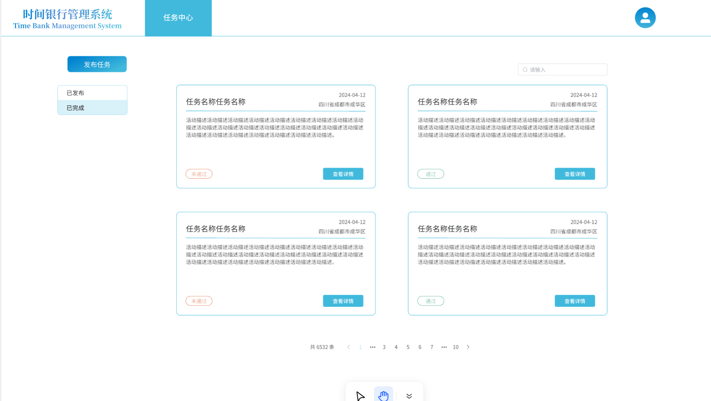
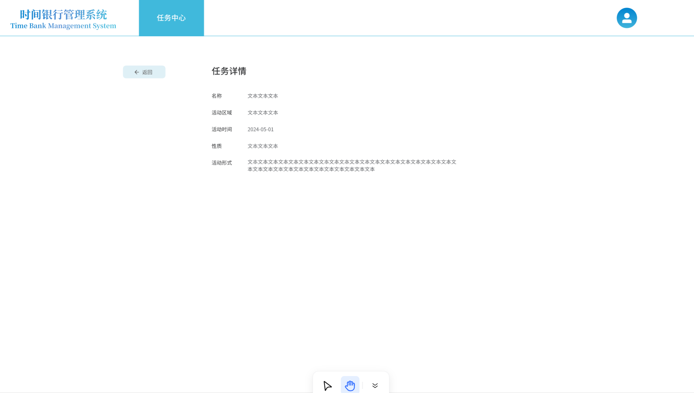

这里的api是针对于右边这个图来进行的，具体功能就是一个**接取**和**分页**
这里就完成了user的功能（点击头像框会出现下拉列表吗？）

API的功能（下面几个API全是GET方法）

"/PublishedMission",查看交易信息，具备了分页功能"——返回的json
```json
{
    "page":123
}
```

"/FinishedMission"查看已完成交易信息，具备分页功能
```json
{
    "page":123
}
```

"/select"完成搜索功能
```json
{
    "input":"???"
}
```

"/publish/Mission"发布交易
```json
{
    "name":---,
    "area":---,
    "begintime":---,
    "endtime":---,
    "mcharacter":---,
    "details":---
    }
```